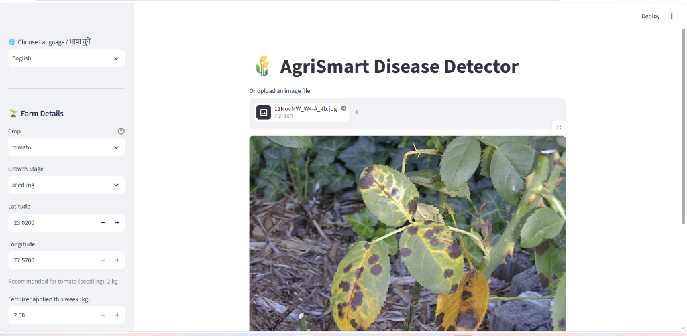
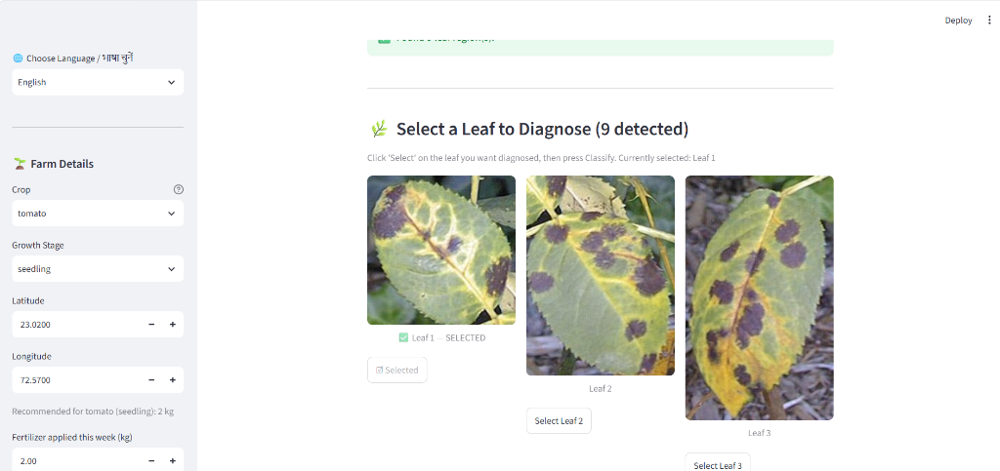
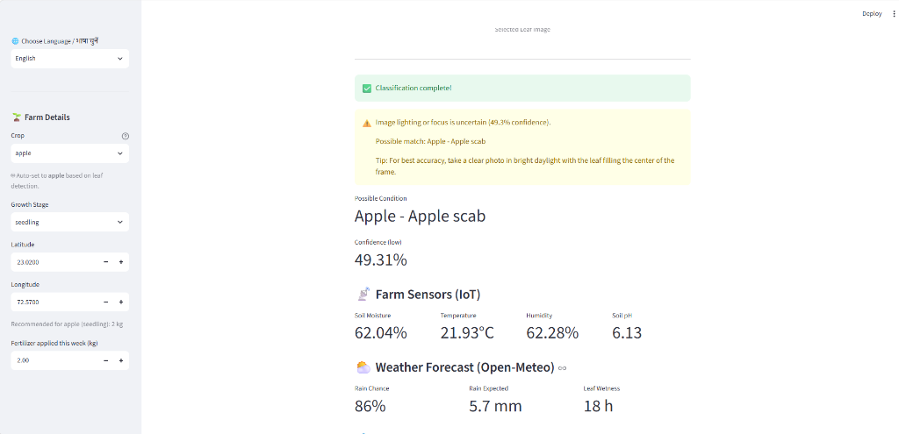
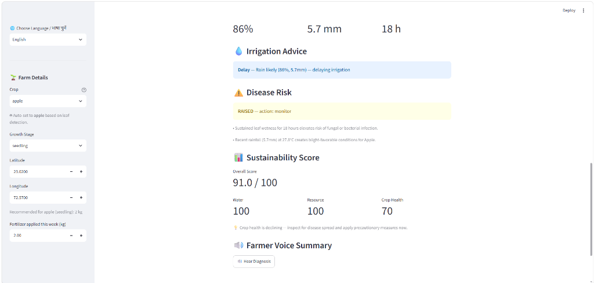

# 🌾 AgriSmart — Query Crew

An AI-powered smart agriculture advisor dashboard built for smallholder farmers. AgriSmart combines **computer vision plant disease classification**, **IoT soil sensor simulation**, **live weather forecasting**, and **multilingual audio-visual advisories** across 9 regional Indian languages.

---

## 📹 Video Demonstration & Live Demo

- **Application Live Dashboard**: Deployable on Render / Streamlit Cloud
- **Video Walkthrough (`Agrismart_AI.mp4`)**: A complete video demonstration showcasing image leaf isolation, MobileNetV2 disease diagnosis, Open-Meteo live weather integration, smart irrigation alerts, and multilingual voice audio readout in Hindi & Gujarati. The video file `Agrismart_AI.mp4` is located in the local project directory for evaluators.

---

## 📸 Application Interface & Workflow Screenshots

| Step 1: Upload Plant Leaf Image | Step 2: Multi-Leaf Detection & Segmentation |
| :---: | :---: |
|  |  |
| *Upload leaf photo with farm location parameters* | *Isolates individual leaves (9 detected) using HSV/YOLO* |

| Step 3: Disease Classification & IoT Sensor Metrics | Step 4: Smart Advisories & Sustainability Score |
| :---: | :---: |
|  |  |
| *MobileNetV2 disease diagnosis (Apple Scab) + live IoT readings* | *Weather-correlated irrigation delay + Sustainability score (91/100)* |

---

## 🌟 Key Highlights & Advantages

1. **Multilingual Regional Voice Assistant (Sarvam AI + gTTS)**:
   - Provides complete text and voice audio support in **9 Indian regional languages**: *English, Hindi (हिंदी), Gujarati (ગુજરાતી), Tamil (தமிழ்), Telugu (తెలుగు), Marathi (मराठी), Bengali (বাংলা), Kannada (ಕನ್ನಡ), Punjabi (ਪੰਜਾਬੀ)*.
   - Farmers can listen to their disease diagnosis and irrigation advice in their native language directly on their phone or computer.

2. **Flexible API Key Configuration (Sarvam AI)**:
   - Configurable via Environment Variable (`export SARVAM_API_KEY="your_api_key"`) or Streamlit secrets (`.streamlit/secrets.toml`).
   - > **Note for Evaluators**: To ensure zero-friction setup for judges, a fallback evaluation API key is configured in `app.py`. Evaluators can also override it using environment variables. After evaluation, the key will be invalidated.

3. **Deep Learning Disease Classification (PlantVillage Dataset)**:
   - Built on a **MobileNetV2** deep learning architecture trained on the benchmark **PlantVillage dataset**.
   - Classifies **24 distinct plant health conditions** across major crops (*Apple, Corn, Grape, Potato, Tomato, Pepper, Strawberry, Soybean, Squash, etc.*).

4. **Resilient "Crop-Then-Classify" Vision Pipeline**:
   - Uses HSV green-channel color space segmentation (with optional YOLO support) to isolate the leaf region and crop out background noise (soil, hands, tools) before passing it to MobileNetV2.

5. **Integrated Agronomic Decision Engines (Bonus Modules B – G)**:
   - **Smart Irrigation (Module B)**: Evaluates IoT soil moisture against 48-hour rain forecasts to prevent overwatering.
   - **Weather Intelligence (Module C)**: Fetches live weather from the free **Open-Meteo REST API**.
   - **Sustainability Score (Module D)**: Dynamic 0–100 rating combining water saving, nutrient balance, and crop health.
   - **IoT Sensor Feed (Module F)**: Streams live simulated sensor readings (Moisture, Temp, Humidity, pH).
   - **Agentic Advisor (Module G)**: Autonomous decision loop (`agent.py`) for continuous monitoring.

---

## 🌿 Trained Crop & Plant Disease Classes (24 Target Classes)

The MobileNetV2 model is trained to recognize **24 target classes** derived from the PlantVillage dataset across 12 distinct crop categories:

| Index | Raw Target Class Name | Crop | Health Condition / Disease | Clean Display Name |
| :---: | :--- | :--- | :--- | :--- |
| `0` | `Apple___Apple_scab` | Apple | Apple Scab | Apple - Apple scab |
| `1` | `Apple___healthy` | Apple | Healthy | Apple - healthy |
| `2` | `Blueberry___healthy` | Blueberry | Healthy | Blueberry - healthy |
| `3` | `Cherry_(including_sour)___healthy` | Cherry | Healthy | Cherry (including sour) - healthy |
| `4` | `Corn_(maize)___Cercospora_leaf_spot Gray_leaf_spot` | Corn | Cercospora / Gray Leaf Spot | Corn (maize) - Cercospora leaf spot Gray leaf spot |
| `5` | `Corn_(maize)___Common_rust_` | Corn | Common Rust | Corn (maize) - Common rust |
| `6` | `Grape___Black_rot` | Grape | Black Rot | Grape - Black rot |
| `7` | `Grape___healthy` | Grape | Healthy | Grape - healthy |
| `8` | `Peach___healthy` | Peach | Healthy | Peach - healthy |
| `9` | `Pepper,_bell___healthy` | Pepper (Bell) | Healthy | Pepper bell - healthy |
| `10` | `Potato___Early_blight` | Potato | Early Blight | Potato - Early blight |
| `11` | `Potato___Late_blight` | Potato | Late Blight | Potato - Late blight |
| `12` | `Raspberry___healthy` | Raspberry | Healthy | Raspberry - healthy |
| `13` | `Soybean___healthy` | Soybean | Healthy | Soybean - healthy |
| `14` | `Squash___Powdery_mildew` | Squash | Powdery Mildew | Squash - Powdery mildew |
| `15` | `Strawberry___healthy` | Strawberry | Healthy | Strawberry - healthy |
| `16` | `Tomato___Bacterial_spot` | Tomato | Bacterial Spot | Tomato - Bacterial spot |
| `17` | `Tomato___Early_blight` | Tomato | Early Blight | Tomato - Early blight |
| `18` | `Tomato___Late_blight` | Tomato | Late Blight | Tomato - Late blight |
| `19` | `Tomato___Leaf_Mold` | Tomato | Leaf Mold | Tomato - Leaf Mold |
| `20` | `Tomato___Septoria_leaf_spot` | Tomato | Septoria Leaf Spot | Tomato - Septoria leaf spot |
| `21` | `Tomato___Tomato_Yellow_Leaf_Curl_Virus` | Tomato | Yellow Leaf Curl Virus | Tomato - Tomato Yellow Leaf Curl Virus |
| `22` | `Tomato___Tomato_mosaic_virus` | Tomato | Mosaic Virus | Tomato - Tomato mosaic virus |
| `23` | `Tomato___healthy` | Tomato | Healthy | Tomato - healthy |

<details>
<summary><b>Click to view raw Python array definition (<code>TARGET_CLASSES</code>)</b></summary>

```python
TARGET_CLASSES = [
    "Apple___Apple_scab",
    "Apple___healthy",
    "Blueberry___healthy",
    "Cherry_(including_sour)___healthy",
    "Corn_(maize)___Cercospora_leaf_spot Gray_leaf_spot",
    "Corn_(maize)___Common_rust_",
    "Grape___Black_rot",
    "Grape___healthy",
    "Peach___healthy",
    "Pepper,_bell___healthy",
    "Potato___Early_blight",
    "Potato___Late_blight",
    "Raspberry___healthy",
    "Soybean___healthy",
    "Squash___Powdery_mildew",
    "Strawberry___healthy",
    "Tomato___Bacterial_spot",
    "Tomato___Early_blight",
    "Tomato___Late_blight",
    "Tomato___Leaf_Mold",
    "Tomato___Septoria_leaf_spot",
    "Tomato___Tomato_Yellow_Leaf_Curl_Virus",
    "Tomato___Tomato_mosaic_virus",
    "Tomato___healthy"
]
```
</details>

---

## 📁 Repository Structure

```text
Query_Crew/
├── README.md               # Project documentation, highlights, and run instructions
├── Agrismart_AI_Report.docx # Model training report, augmentation & confusion matrix charts
├── Agrismart_AI.mp4        # Video demonstration walkthrough (362MB)
├── requirements.txt        # Python package dependencies (uv and pip supported)
├── app.py                  # Main Streamlit dashboard UI entry point
├── render.yaml             # Render.com deployment blueprint
├── download_models.py      # Weights downloader script (auto-detects uv or pip)
├── agent.py                # Headless autonomous decision loop test runner (Module G)
├── debug_pipeline.py       # Diagnostic CV model test script
├── assets/                 # Application workflow screenshots & UI diagrams
│   ├── 01_upload_interface.png
│   ├── 02_leaf_segmentation.png
│   ├── 03_disease_diagnosis_iot.png
│   └── 04_advisories_sustainability.png
├── src/                    # Core application modular source code
│   ├── predict.py          # MobileNetV2 disease classification inference interface
│   ├── cv_utils.py         # OpenCV HSV leaf isolation & green-channel extraction
│   ├── disease_risk.py     # Weather-correlated disease risk assessment engine (Module C)
│   ├── irrigation.py       # Smart irrigation advisory logic (Module B)
│   ├── fertilizer.py       # Crop stage nutrient & fertilizer guidance
│   ├── sustainability.py   # Environmental & resource efficiency scoring 0-100 (Module D)
│   ├── sensors.py          # Simulated IoT farm sensor feed (Module F)
│   └── weather.py          # Open-Meteo live weather API client (Module C)
└── model/                  # Deep learning models & weights
    ├── phase2_best_model.keras   # Trained MobileNetV2 24-class disease model
    ├── yolo11x_leaf.pt           # YOLO11 leaf detector model weights
    └── download_models.py        # Model downloader copy
```

---

## 🎯 Evaluation Criteria Implementation Matrix (Points B – G)

| Rubric Point | Module & File | Logic / Data Source / Approach | Status |
| :--- | :--- | :--- | :---: |
| **B. Smart Irrigation** | [`src/irrigation.py`](file:///d:/Query_Crew%20-%20Copy/src/irrigation.py) | **Logic**: Compares IoT soil moisture against crop-specific targets (e.g. Tomato 60–80%) and 48h rain forecast. Prevents overwatering if rain chance $\ge 60\%$ or rain $\ge 5\text{ mm}$. | ✅ Complete |
| **C. Weather Intelligence** | [`src/weather.py`](file:///d:/Query_Crew%20-%20Copy/src/weather.py)<br>[`src/disease_risk.py`](file:///d:/Query_Crew%20-%20Copy/src/disease_risk.py) | **Source**: Live forecast from **Open-Meteo REST API** (lat/lon grounded). Produces humanized warnings for elevated disease risks and rain delays. | ✅ Complete |
| **D. Sustainability Score** | [`src/sustainability.py`](file:///d:/Query_Crew%20-%20Copy/src/sustainability.py) | **Formula**: Score $= 0.40 \cdot \text{WaterEfficiency} + 0.30 \cdot \text{ResourceBalance} + 0.30 \cdot \text{CropHealthScore}$ (Scale 0–100). | ✅ Complete |
| **E. Farmer Assistant & Voice** | [`app.py`](file:///d:/Query_Crew%20-%20Copy/app.py) | **Localization**: Grounded AI diagnosis translated into **9 regional Indian languages** via Sarvam AI API. Audio voice readout via `gTTS`. | ✅ Complete |
| **F. IoT Integration** | [`src/sensors.py`](file:///d:/Query_Crew%20-%20Copy/src/sensors.py) | **Feed**: `SimulatedFarmSensors` class streaming continuous live readings for Soil Moisture (%), Temp (°C), Humidity (%), and pH. | ✅ Complete |
| **G. Agentic Advisor** | [`agent.py`](file:///d:/Query_Crew%20-%20Copy/agent.py) | **Decision Loop**: Autonomous cycle (`read` $\rightarrow$ `reason` $\rightarrow$ `decide` $\rightarrow$ `notify`). Tracks notification history to prevent duplicate alert spam. | ✅ Complete |

---

## 🚀 Quick Start Guide

### Option 1: Fast Setup using `uv` (Recommended)

```bash
# 1. Install uv (if not already installed)
pip install uv

# 2. Navigate to project folder
cd Query_Crew

# 3. Create & activate virtual environment
uv venv
.venv\Scripts\activate      # On Windows
source .venv/bin/activate   # On Linux/macOS

# 4. Install dependencies
uv pip install -r requirements.txt

# 5. Run application
streamlit run app.py
```

---

### Option 2: Standard Setup using `pip`

```bash
python -m venv myenv
myenv\Scripts\activate      # On Windows
source myenv/bin/activate   # On Linux/macOS
pip install -r requirements.txt
streamlit run app.py
```

---

## ⚠️ Known Limitations & Future Enhancements

1. **Hardware IoT Integration**:
   - Currently uses a simulated IoT stream (`SimulatedFarmSensors`) to generate realistic continuous soil moisture, temperature, humidity, and pH readings. Physical hardware integration (e.g. ESP32 / Arduino MQTT bridge) is planned as a future hardware addon.

2. **Network Dependency for Translation**:
   - Sarvam AI regional translation requires active internet access. If network connections are lost, the application seamlessly falls back to English advisories.
